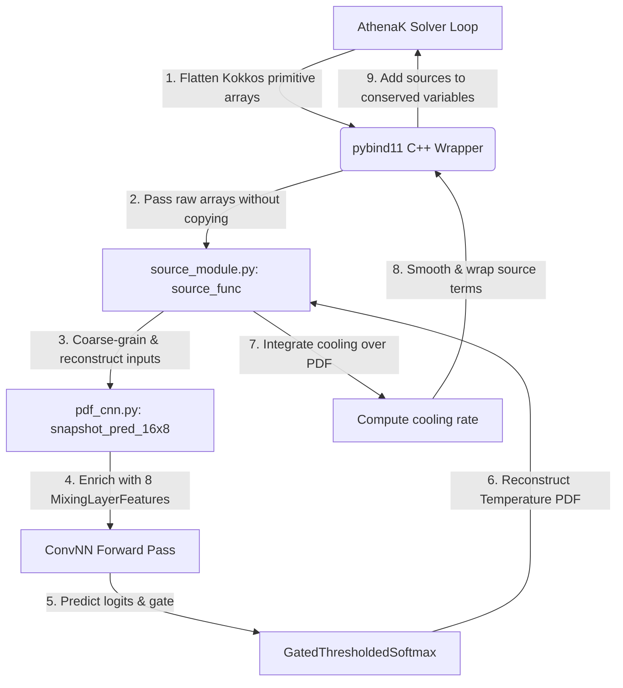

# Subgrid CGM Modelling Project

> This README was AI generated and has not been proofread. (and it's not very good).
> 
> I'm leaving it in for now so I don't lose it.

This repository contains the subgrid modelling pipeline for the Circumgalactic Medium (CGM). The project bridges a highly-parallelized C++ simulation environment with a PyTorch-based deep learning framework to predict subgrid radiative cooling and source terms from unresolved multi-phase gas structures.

The pipeline consists of three core components:
1. **AthenaK** (C++/Kokkos): Generates high-fidelity Kelvin-Helmholtz instability simulations with radiative cooling to produce raw training data, and runs low-resolution simulations with subgrid closures.
2. **ML Pipeline** (Python/PyTorch): Preprocesses simulation outputs and trains fully connected (FNN), convolutional (CNN), and convolutional LSTM (ConvLSTM) models to predict temperature probability density functions (PDFs) and source terms.
3. **Integration Bridge** (pybind11): Embeds a Python interpreter inside AthenaK to perform dynamic subgrid model inference during runtime.

---

## 🌟 Core Features & Latest Updates

The repository has been updated with several major architecture enhancements to improve physics representation, model stability, and performance:

### 1. Physics-Informed Mixing Layer Features
Instead of training purely on raw fields, inputs are enriched via the `MixingLayerFeatures` module with **8 physics-informed channels** that capture the local fluid dynamics:
* **`|ω|` and signed `ω`**: Vorticity magnitude and sign to identify shear/Kelvin-Helmholtz roll rotation.
* **`|∇T|` and `|∇ρ|`**: Sobel-filtered temperature and density gradients representing thermal/density contrast.
* **`cos θ = (∇T · ∇ρ)/(|∇T||∇ρ|)`**: The alignment between density and temperature gradients (critical for baroclinic vorticity generation).
* **`|σ|`**: Strain rate magnitude capturing compressive mixing.
* **`ρ|ω|`**: Densimetric vorticity weighting shear by inertia.
* **`(T - T̄)²` proxy**: Local temperature variance within a coarse cell (indicative of multi-phase structures).

### 2. Gated PDF Emissivity Architecture
To handle boundary interfaces cleanly, the model implements a spatial gate $g(x,y) \in [0, 1]$ using a convolutional `MixingLayerGate` branch:
* **Single-Phase Cells ($g \approx 0$)**: The PDF collapses to a sharp delta-function peak at the cell's average temperature.
* **Mixed-Phase Cells ($g \approx 1$)**: The full `ThresholdedSoftmax` PDF is allowed.
* **`GatedThresholdedSoftmax`**: Smoothly interpolates between the two states to guarantee non-negative PDFs that sum to 1 while eliminating artificial noise.

### 3. Gated Loss Function (`GatedPDFEmissivityLoss`)
Models are trained using a multi-term objective combining physical and structural constraints:
* **KL Divergence**: Matches predicted and true temperature PDFs.
* **Pixelwise Emissivity MSE**: Minimizes $L_{10}$ difference of computed cooling rate over the grid.
* **Emissivity Profile MSE**: Direct constraint on the spatial column-average cooling profiles to match large-scale structures.
* **Gate Supervision (BCE)**: Supervised using a normalized Shannon entropy threshold derived from the true PDF.

### 4. Centralized Cooling Rate Calculation
The standardized `compute_cooling_rate` function computes physical radiative cooling ($\Lambda(T) \cdot n^2$) in internal code units. It unifies:
* **Fine-grid scalar cooling**: Computed directly on primitive simulation outputs.
* **Coarse-grid PDF cooling**: Integrated over the temperature PDF under isobaric assumptions.

### 5. Metal Performance Shaders (MPS) Acceleration
Full compatibility with Apple Silicon GPUs (`device = torch.device("mps")`) is now implemented, ensuring fast local training and validation.

---

## 📂 Project Structure

```
SubgridCGMModel/
├── athenak/                    # AthenaK MHD simulation code (C++/Kokkos)
│   ├── src/                    # C++ source code
│   │   └── pgen/subgrid.cpp    # pybind11 integration calling source_module.py
│   ├── inputs/                 # Simulation parameter input files (.athinput)
│   ├── scripts/                # Build and helper scripts
│   └── ...
├── builds/
│   └── subgrid_model/src/
│       └── source_module.py    # Python bridge called by AthenaK; performs inference
├── models/                     # Deep learning models
│   ├── feedforward_nn/         # Fully connected models (fnn.py)
│   ├── conv_lstm/              # Convolutional LSTM (clstm.py) for temporal evolution
│   └── conv_nn/                # Convolutional Neural Networks
│       ├── pdf_cnn.py          # [Active] Gated PDF network with mixing layer features & MPS training
│       ├── cnn.py              # Baseline CNN for source term predictions
│       ├── flux_cnn.py         # Flux prediction CNN
│       └── ...
├── data/                       # Preprocessing and loading utilities
│   ├── data_preprocess.py      # Coarse-graining and gradient feature extractors
│   ├── bin_convert.py          # Raw bin converter C-extension loader
│   └── mocks/                  # Baseline mocks and validation scripts
│       └── pdf_plot.py         # Generates validation/comparison plot animations
├── outputs/                    # Local training outputs (Git-ignored)
│   ├── model_saves/            # Saved weights (.pth) and normalization constants (.npy)
│   └── loss_plots/             # loss curve figures
├── mocks/pdf/                  # Validation visuals (animations comparing True/Predicted cooling, vorticity, gates)
├── docs/                       # Detailed documentation
│   ├── build_instructions.md   # C++/AthenaK compile and build recipes
│   ├── neural_network_setup.md # Explanation of integration architecture
│   └── nn_athenak_interaction.md
├── requirements.txt            # Python dependencies
└── README.md                   # This file
```

---

## 🚀 Getting Started

### 1. Prerequisites
Install the Python pipeline packages:
```bash
pip install -r requirements.txt
```

### 2. Environment Variables
Set the environment paths before training or inference:
```bash
export SUBGRID_DATA_PATH="/path/to/simulation/bin"    # Folder containing raw .bin files
export SUBGRID_CACHE_PATH="/path/to/cache"            # Cache directory for preprocessed .npy files
```

### 3. Model Training & Diagnostics
Run the training script for the gated PDF CNN:
```bash
python models/conv_nn/pdf_cnn.py
```
This saves trained weights (`cnn_1024_512_64.pth`) and normalization stats (`cnn_1024_512_64_input_mean.npy`/`std.npy`) to `outputs/model_saves/pdf_model_saves/` and logs progress.

### 4. Running Validation Visualizations
Use the mock plotting utility to check the predictions and view comparisons:
```bash
python data/mocks/pdf_plot.py
```
This generates comparison plots and MP4 animations under `mocks/pdf/` illustrating:
* True vs. Predicted spatial cooling rates.
* Gating values $g(x,y)$ overlaid with vorticity contours.

---

## 🔧 Integration Architecture

At runtime, the C++ solver integrates the PyTorch model predictions back into the hydrodynamics solver loop:



For compilation and runtime execution details of the C++ simulator, see [docs/build_instructions.md](file:///Volumes/PortableSSD/Projects/SubgridCGMModel/docs/build_instructions.md).
