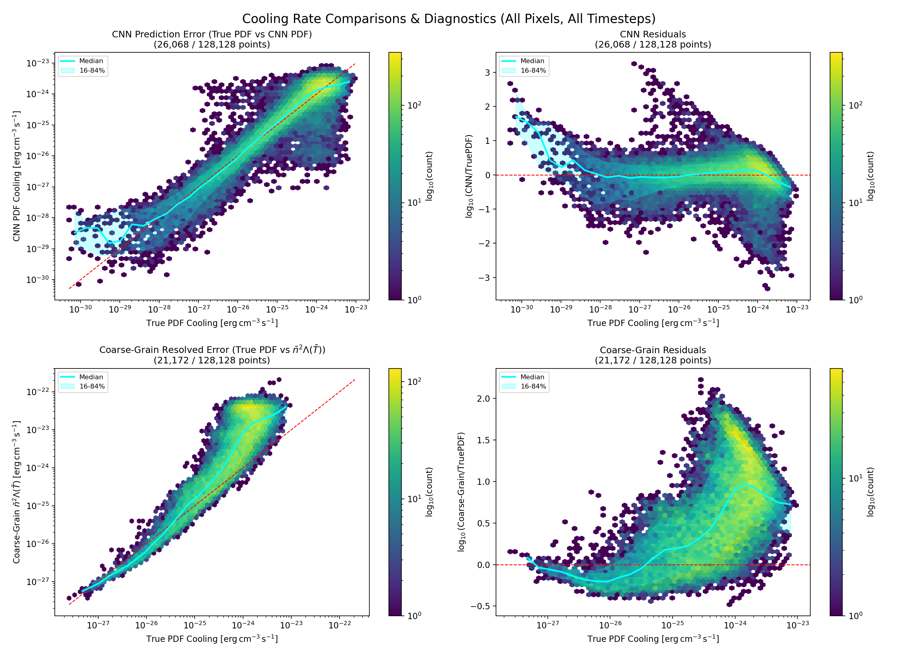
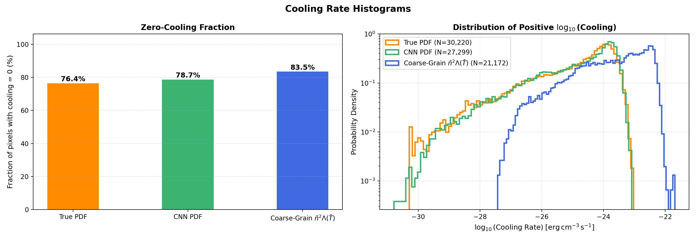

# Machine Learning Setup

## ML Architecture

```tikz
\documentclass[tikz,border=8pt]{standalone}

\usepackage{tikz}
\usepackage{amsmath}
\usetikzlibrary{positioning,arrows.meta,calc,decorations.pathreplacing}

\definecolor{teal}{rgb}{0,0.5,0.5}

\begin{document}

\begin{tikzpicture}[
    >=Latex,
    font=\small,
    arrow/.style={->, thick, shorten >=2pt, shorten <=2pt},
    gatearrow/.style={->, thick, red!70!black, shorten >=2pt, shorten <=2pt}
]

% ============================================================
% 3D feature-map helper
% ============================================================

\newcommand{\featurestack}[7]{%
    \begin{scope}[shift={(#2,#3)}]
        \foreach \z in {#6,...,1} {
            \pgfmathsetmacro{\dx}{0.04*\z}
            \pgfmathsetmacro{\dy}{0.04*\z}
            \path[draw=#7!55!black, fill=#7!45, rounded corners=1pt, line width=0.5pt]
            (\dx,\dy) rectangle ({#4+\dx},{#5+\dy});
        }
        \path[draw=#7!70!black, fill=#7!12, rounded corners=1pt, thick]
        (0,0) rectangle (#4,#5);
        \foreach \i in {1,...,4} {
            \pgfmathsetmacro{\yy}{#5*\i/5}
            \draw[#7!40!black, line width=0.35pt] (0.08,\yy) -- ({#4-0.08},\yy);
        }
        \node[align=center, text=#7!55!black, font=\scriptsize] at ({#4/2},{#5/2}) {#1};
    \end{scope}
}

% ============================================================
% Main Path
% ============================================================

\featurestack{Input}{0}{0.15}{1.25}{3.1}{5}{blue}
\featurestack{13}{1.7}{0.2}{1.2}{3.0}{10}{teal}

% Encoder
\featurestack{32}{3.5}{0.275}{1.15}{2.85}{12}{green}
\featurestack{64}{5.3}{0.4}{1.05}{2.6}{16}{green}
\featurestack{128}{7.1}{0.525}{0.95}{2.35}{20}{green}
\featurestack{256}{8.9}{0.65}{0.85}{2.1}{24}{green!70!black}

% Decoder
\featurestack{128}{10.7}{0.525}{0.95}{2.35}{20}{orange}
\featurestack{64}{12.5}{0.4}{1.05}{2.6}{16}{orange}
\featurestack{32}{14.3}{0.275}{1.15}{2.85}{12}{orange}
\featurestack{40}{16.1}{0.2}{1.2}{3.0}{10}{orange!50!black}

% Gated Softmax & Output
\node[draw=violet!60!black, fill=violet!8, rounded corners=2pt, thick,
      minimum width=1.5cm, minimum height=1.5cm, align=center]
      (softmax) at (19.25,1.7) {\textbf{Gated}\\ \textbf{Softmax}};

\featurestack{Output}{20.5}{0.15}{1.25}{3.1}{10}{violet}

% ============================================================
% Gate Branch — all stacks: bottom y = -3.2, height = 2.8
% so center y = -1.8 and top y = -0.4 (uniform)
% ============================================================

\featurestack{8}{1.7}{-3.2}{1.2}{2.8}{8}{teal}
\featurestack{16}{3.5}{-3.2}{1.15}{2.8}{8}{red}
\featurestack{8}{5.3}{-3.2}{1.05}{2.8}{6}{red}
\featurestack{$g$}{7.1}{-3.2}{0.95}{2.8}{3}{red!70!black}

% ============================================================
% Arrows — Main Path
% ============================================================

\draw[arrow] (1.25, 1.7) -- (1.7,  1.7);
\draw[arrow] (2.9,  1.7) -- (3.5,  1.7);
\draw[arrow] (4.65, 1.7) -- (5.3,  1.7);
\draw[arrow] (6.35, 1.7) -- (7.1,  1.7);
\draw[arrow] (8.05, 1.7) -- (8.9,  1.7);
\draw[arrow] (9.75, 1.7) -- (10.7, 1.7);
\draw[arrow] (11.65,1.7) -- (12.5, 1.7);
\draw[arrow] (13.55,1.7) -- (14.3, 1.7);
\draw[arrow] (15.45,1.7) -- (16.1, 1.7);
\draw[arrow] (17.3, 1.7) -- (18.5, 1.7);
\draw[arrow] (20.0, 1.7) -- (20.5, 1.7);

% ============================================================
% Arrows — Gate Branch (arrows at center y = -1.8)
% ============================================================

\draw[gatearrow] (2.9,  -1.8) -- (3.5,  -1.8);
\draw[gatearrow] (4.65, -1.8) -- (5.3,  -1.8);
\draw[gatearrow] (6.35, -1.8) -- (7.1,  -1.8);

% MixingLayerFeatures teal → gate teal (vertical tap-off)
% Main teal bottom: y=0.2; gate teal top (front face): y=-0.4
\draw[gatearrow] (2.3, 0.2) -- (2.3, -0.45);

% Gate "g" output → Gated Softmax
% Rise from top of "g" front face (7.575, -0.4), cross in the gap, enter softmax from below
\draw[gatearrow] (7.575,-0.4) -- (7.575,-0.2) -- (19.25,-0.2) -- (19.25, 0.95);

% ============================================================
% Dimension Labels — staggered to avoid overlap
%   odd  positions: y = 3.85 (low)
%   even positions: y = 4.35 (high)
% ============================================================

\node[text=blue!50!black,   font=\scriptsize\itshape] at (0.625,  3.85) {$5   \times H \times W$};
\node[text=teal!50!black,   font=\scriptsize\itshape] at (2.3,    4.35) {$13  \times H \times W$};
\node[text=green!50!black,  font=\scriptsize\itshape] at (4.075,  3.85) {$32  \times H \times W$};
\node[text=green!50!black,  font=\scriptsize\itshape] at (5.825,  4.35) {$64  \times H \times W$};
\node[text=green!50!black,  font=\scriptsize\itshape] at (7.575,  3.85) {$128 \times H \times W$};
\node[text=green!60!black,  font=\scriptsize\itshape] at (9.325,  4.35) {$256 \times H \times W$};
\node[text=orange!50!black, font=\scriptsize\itshape] at (11.175, 3.85) {$128 \times H \times W$};
\node[text=orange!50!black, font=\scriptsize\itshape] at (13.025, 4.35) {$64  \times H \times W$};
\node[text=orange!50!black, font=\scriptsize\itshape] at (14.875, 3.85) {$32  \times H \times W$};
\node[text=orange!60!black, font=\scriptsize\itshape] at (16.7,   4.35) {$40  \times H \times W$};
\node[text=violet!50!black, font=\scriptsize\itshape] at (21.125, 3.85) {$40  \times H \times W$};

% Gate dimension labels — all at same y since stacks share a common bottom
\node[text=teal!50!black,  font=\scriptsize\itshape] at (2.3,   -3.65) {$8  \times H \times W$};
\node[text=red!50!black,   font=\scriptsize\itshape] at (4.075, -3.65) {$16 \times H \times W$};
\node[text=red!50!black,   font=\scriptsize\itshape] at (5.825, -3.65) {$8  \times H \times W$};
\node[text=red!60!black,   font=\scriptsize\itshape] at (7.575, -3.65) {$1  \times H \times W$};

% ============================================================
% Braces and section captions
% ============================================================

\draw[decorate, decoration={brace, amplitude=5pt}, thick, green!55!black]
    (3.4, 4.6) -- (9.85, 4.6)
    node[midway, above=10pt, font=\small\bfseries, text=green!45!black] {Encoder};

\draw[decorate, decoration={brace, amplitude=5pt}, thick, orange!65!black]
    (10.6, 4.6) -- (17.4, 4.6)
    node[midway, above=10pt, font=\small\bfseries, text=orange!65!black] {Decoder};

\draw[decorate, decoration={brace, amplitude=5pt, mirror}, thick, red!60!black]
    (1.8, -4.2) -- (8.15, -4.2)
    node[midway, below=10pt, font=\small\bfseries, text=red!60!black] {MixingLayerGate};

% ============================================================
% Text annotations
% ============================================================

% MixingLayerFeatures label — positioned above brace, left side
\node[font=\small\bfseries, text=teal!55!black, align=center] at (2.3, 6.05)
    {MixingLayerFeatures};
\node[font=\scriptsize, text=teal!55!black, align=center] at (2.3, 5.55)
    {$5 \to 13$ channels\\ $+8$ physics features};

% Conv-block recipe — shifted right so it doesn't collide with MixingLayerFeatures
\node[font=\small, text=gray!65!black, align=center] at (9.0, 6)
    {Every conv block: Conv $k \times k$ $\rightarrow$ BN $\rightarrow$ ReLU\\
     (Dropout after first two enc blocks)};

% Gate activation note — below brace label, clear of "MixingLayerGate"
\node[font=\scriptsize, text=red!55!black, align=center] at (5, -5.15)
    {Conv $+$ BN $+$ ReLU $+$ Sigmoid};

% ============================================================
% Input legend — moved left of the input stack to avoid gate overlap
% ============================================================

\node[align=left, text=blue!55!black, font=\small] at (-2.2, 1.7)
{{\small \textbf{Input} ($5\times H\times W$):}\\[3pt]
\begin{tabular}{@{}ll@{}}
 $\rho$    & density \\
 $T$       & temperature \\
 $u_x,u_y$ & velocity \\
 $p_s$     & passive scalar \\
\end{tabular}};

% ============================================================
% Output annotations — right side
% ============================================================

\node[align=center, text=violet!55!black, font=\small] at (21.125, -1.5)
{{\small \textbf{Predicted PDF}}\\[3pt]
Non-negative,\\ normalized 40-bin PDF};

\node[align=center, text=violet!55!black, font=\small] at (19.25, -3.2)
{{\small \textbf{GatedThresholdedSoftmax}}\\[3pt]
Broad: $\operatorname{softmax}(\text{logits})$\\
Sharp: $\operatorname{softmax}(\text{logits}/0.02)$\\
$g\,p_{\rm broad}+(1-g)\,p_{\rm sharp}$};

\end{tikzpicture}

\end{document}
```

## Physics-Informed Loss Function {.smaller}

$$\mathcal{L}_{\text{total}} = \alpha_\mathrm{active}\mathcal{L}_{\mathcal{W}_1} + \alpha_\mathrm{inactive}\mathcal{L}_{\mathcal{W}_1} + \alpha_{\text{gate}}\mathcal{L}_{\text{gate}} + \alpha_{\bar{T}}\mathcal{L}_{\bar{T}} + \alpha_{\text{emiss}}\mathcal{L}_{\text{emiss}} + \alpha_{\text{leak}}\mathcal{L}_{\text{leak}}$$

::: {.columns}
::: {.column width="50%"}
- **$\mathcal{L}_{\mathcal{W}_1}$ (Zoned Wasserstein-1)**:
  Broken into two sections: Inside and Outside the active range $$T_\mathrm{min} \le T [\text{K}] \le T_\mathrm{max}$$

- **$\mathcal{L}_{\text{gate}}$ (Gate Supervision)**:
  Binary cross-entropy to learn the gating field $$g_{ij} = \delta_{ij}(PDF[\text{active range}])$$
:::

::: {.column width="50%"}
- **$\mathcal{L}_{\bar{T}}$**: Predicted PDF should match the input temperature $\bar{T}$
   $$\mathcal{L}_{\bar{T}} = \mathrm{MSE} \left( \mathbb{E}[T]_{\text{pred}}, T_{\text{coarse}} \right)$$

- **$\mathcal{L}_{\text{emiss}}$**: Matches integrated emissivity $\mathcal{E} = n^2 \sum p(T_i)\Lambda(T_i)$.

$$\mathcal{L}_\mathrm{emiss} = \mathrm{MSE} \left( \mathcal{E}_\mathrm{pred}, \mathcal{E}_\mathrm{true}\right)$$

- **$\mathcal{L}_{\text{leak}}$**: Don't put mass in the active range if there's nothing there originally.

:::
::: 

## Training & Testing Datasets {.smaller}

<div style="display: flex; justify-content: center; margin: 0 auto 12px auto;">
  <video controls playsinline preload="metadata" width="96%" style="border-radius: 6px; background: #ffffff;">
    <source src="assets/data_overview.mp4" type="video/mp4">
  </video>
</div>

- High-res simulations following @Sharma2025UniversalStructureTRML


::: {.columns style="font-size: 0.85em;"}
::: {.column width="50%"}
- **Training Data**: High-res $1024 \times 2048$ box coarse-grained to $32 \times 16$, dynamically sampling random $16 \times 8$ patches per snapshot.
:::

::: {.column width="50%"}
- **Testing Data**: Independent $256 \times 512$ domain downsampled to $16 \times 8$ for full-domain testing.
:::
:::

# Model Performance

## Do we even need an ML Model? {.smaller}

::: {.columns}
::: {.column width="75%"}
<div style="display: flex; justify-content: center; margin: 0 auto 12px auto;">
  
</div>
:::

::: {.column width="25%"}
- $\bar{n}^2 \Lambda (\bar{T}) \neq \left< n^2 \Lambda (T) \right>$
- $\bar{n}^2 \Lambda (\bar{T})$ systematically overestimates cooling, by orders of magnitude.
- CNN predicts the true cooling value more consistently.
:::
:::


## Do we even need an ML Model? {.smaller}

<div style="display: flex; justify-content: center; margin: 0 auto 12px auto;">
  
</div>

- $\bar{n}^2 \Lambda (\bar{T}) \neq \left< n^2 \Lambda (T) \right>$
- $\bar{n}^2 \Lambda (\bar{T})$ overpredicts the number of pixels with zero cooling as well
- CNN is able to recover the bins where there is no cooling.

## Do we even need an ML Model? {.smaller}

<div style="display: flex; justify-content: center; margin: 0 auto 12px auto;">
  <video controls playsinline preload="metadata" width="96%" style="border-radius: 6px; background: #ffffff;">
    <source src="assets/pdf_cooling_compare_animation.mp4" type="video/mp4">
  </video>
</div>

::: {.columns style="font-size: 0.85em;"}
::: {.column width="33%"}
- Left: True Coarse grain value of the cooling
:::

::: {.column width="33%"}
- Middle: Cooling rate predicted by the Model
:::

::: {.column width="33%"}
- Right: Formula applied to coarse-grained temperature $\bar{T}$
:::
:::

## Running Online with AthenaK 

```{mermaid}
graph LR
      A[Fields From AthenaK] --> B[ML Model]
      B --> C[Produce PDF]
      C --> D[Calculate PDF Cooling]
      D --> E{Unphysical amount of <br> Energy Removed?}
      E -- Yes --> F[Clip Energy Value]
      E -- No --> G[Update AthenaK State]
      F --> G
```

- Run an LR simulation for 5 Myr. 
- 5 Myr restart file used for the subgrid run. 

## Profiles running online with AthenaK