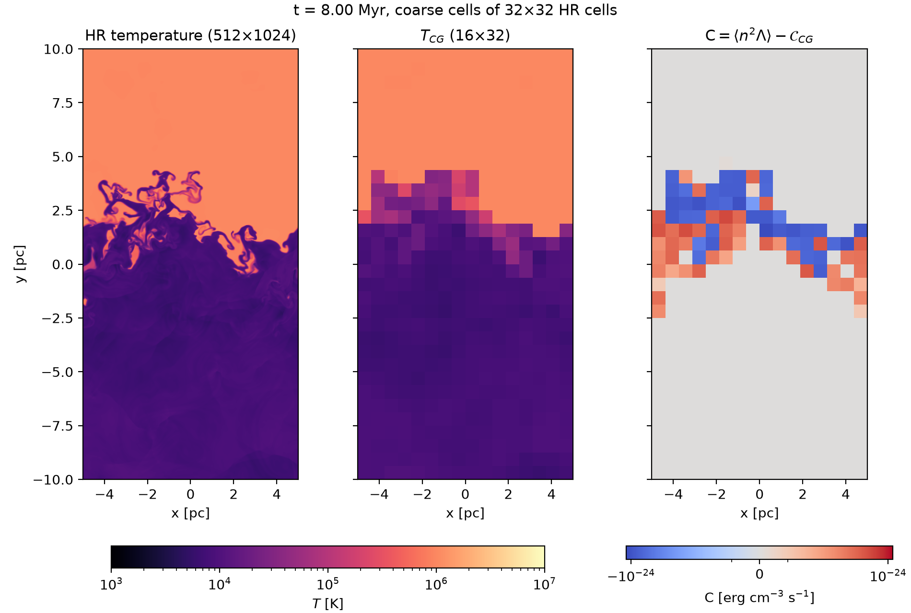
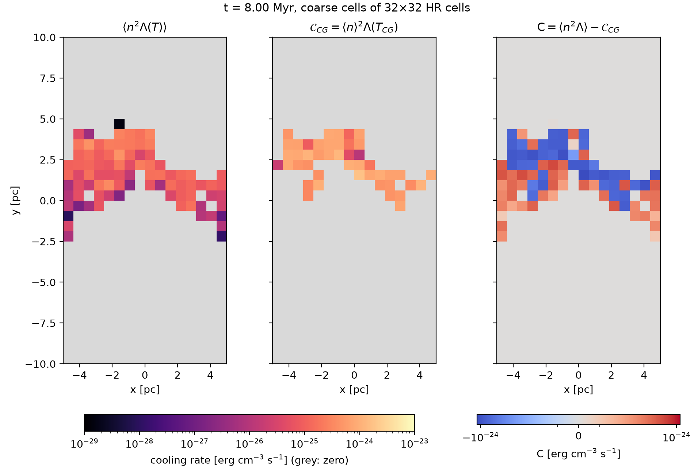
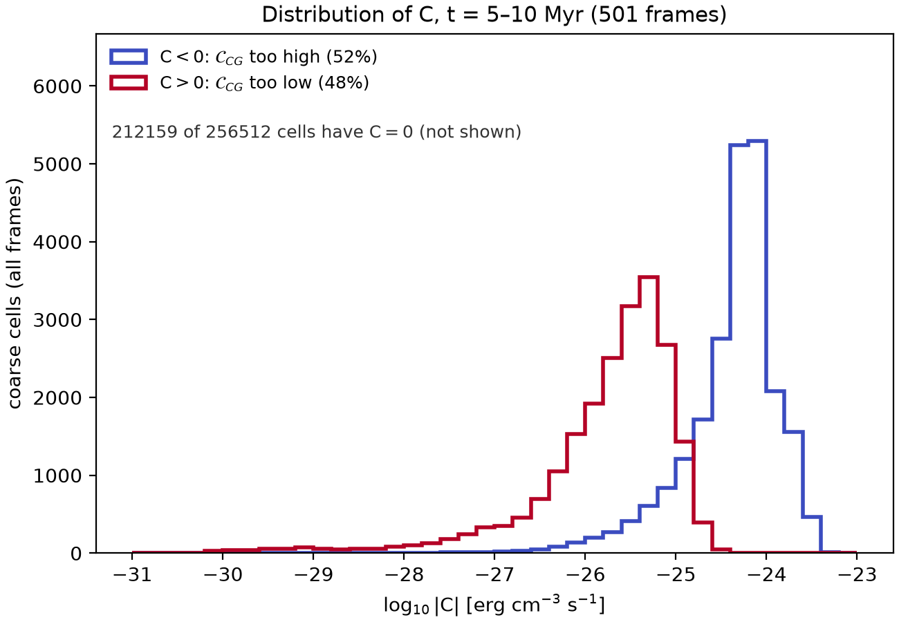
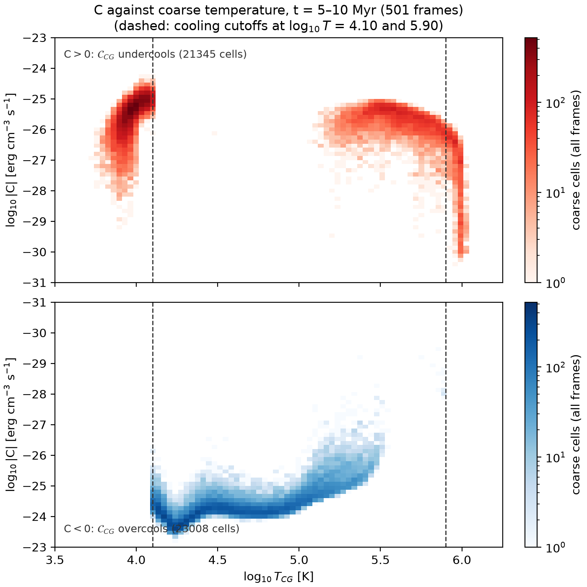
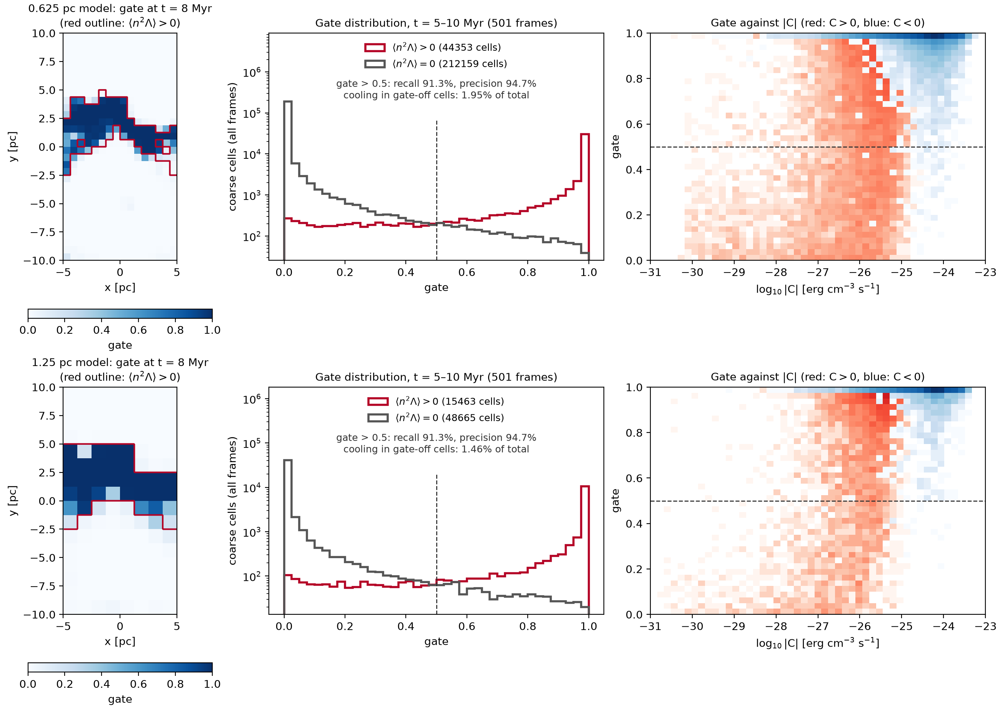
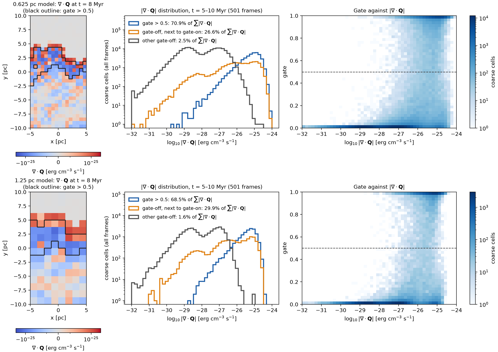

# The Equations

## Euler equations with cooling

$$
\begin{aligned}
\partial_t \rho + \nabla\cdot(\rho\mathbf{v}) &= 0 \\
\partial_t (\rho\mathbf{v}) + \nabla\cdot(\rho\mathbf{v}\mathbf{v} + P\,\mathsf{I}) &= 0 \\
\partial_t E + \nabla\cdot\big[(E + P)\mathbf{v}\big] &= -\dot{\mathcal{E}}
\end{aligned}
$$

$$
E = \frac{P}{\gamma - 1} + \frac 1 2 \rho |\mathbf v|^2, \qquad
P = \frac{\rho k_B T}{\mu m_p}, \qquad
\dot{\mathcal{E}} = n^2 \Lambda(T), \quad n = \frac{\rho}{\mu m_p}
$$

- $\gamma = 5/3$, $\mu = 0.62$
- $\Lambda(T)$: cooling function

## Filtering

- Filter with kernel $G_\Delta$, and define the Favre (density-weighted) average:

$$
\bar{f}(\mathbf x, t) = \int G_\Delta(\mathbf x - \mathbf x') f(\mathbf x', t)\, \mathrm{d}^3 x', \qquad
\tilde{f} = \frac{\overline{\rho f}}{\bar \rho}
$$

- For a top-hat kernel: $\langle f \rangle = \frac{1}{V_\mathrm{cell}} \int f \, \mathrm{d}^3x$

- Germano's generalised central moments, with $\delta a = a - \tilde a$:

$$
\tau(a,b) = \widetilde{ab} - \tilde a\tilde b = \widetilde{\delta a \delta b}
$$

$$
\tau(a, b, c) = \widetilde{a b c} - \tilde a \tau(b,c) - \tilde b \tau(c, a) - \tilde c \tau(a, b) - \tilde a \tilde b \tilde c
$$

## Coarse-grained equations

$$
\begin{aligned}
\partial_t \langle \rho \rangle + \nabla \cdot \langle \rho \mathbf{v} \rangle &= 0 \\
\partial_t \langle \rho \mathbf{v} \rangle + \nabla\cdot\left[ \langle \rho \mathbf{v} \mathbf{v} \rangle + \langle P \rangle \mathsf{I} \right] &= 0 \\
\partial_t \langle E \rangle + \nabla\cdot\langle (E + P)\, \mathbf{v} \rangle &= - \langle n^2 \Lambda(T) \rangle
\end{aligned}
$$

The averages of products are not products of averages. Each one gives a subgrid term:

- $\langle \rho \mathbf v \mathbf v \rangle$ → momentum flux $\mathsf R_{\rho vv}$
- $\langle (E+P)\mathbf v \rangle$ → energy flux $\mathsf Q$
- $\langle n^2 \Lambda(T) \rangle$ → cooling correction $\mathsf C$

## Subgrid momentum flux $\mathsf R$

$$
\langle \rho \mathbf{v} \mathbf{v} \rangle = \frac{\langle\rho \mathbf{v} \rangle \langle\rho \mathbf{v} \rangle}{\langle \rho \rangle} + \mathsf{R}_{\rho vv},
\qquad \mathsf R_{ij} = \langle\rho \rangle \tau(v_i, v_j)
$$

- Symmetric tensor: the residual momentum flux
- Its trace is the subgrid kinetic energy, so it also enters the pressure:

$$
\frac{\langle P \rangle}{\gamma -1} = \langle E \rangle - \frac 1 2\mathrm{Tr}\left\langle \frac{\langle\rho \mathbf{v} \rangle \langle\rho \mathbf{v} \rangle}{\langle \rho \rangle}\right\rangle - \frac 1 2\mathrm{Tr}\,\mathsf{R}_{\rho v v}
$$

::: {.callout-tip}
## Galilean invariant
Under $\mathbf v \to \mathbf v + \mathbf V$, the cross terms and $\mathbf V \mathbf V$ terms cancel, so $\mathsf R'_{\rho vv} = \mathsf R_{\rho vv}$.
:::

## Subgrid energy flux $\mathsf Q$

$$
\langle(E + P) \mathbf{v} \rangle = \left( \langle E \rangle + \langle P \rangle \right) \frac{\langle \rho \mathbf{v} \rangle}{\langle \rho \rangle} + \mathsf{Q}
$$

With the specific enthalpies $h_t = (E+P)/\rho = h + \tfrac12 v_j v_j$ and $h = \frac{\gamma}{\gamma-1}\frac{P}{\rho}$:

$$
\mathsf{Q}_i = \langle \rho \rangle \tau(h_t, v_i)
= \underbrace{\tilde v_j \mathsf{R}_{ij}}_{\text{via } \mathsf R}
+ \underbrace{\tfrac 1 2 \langle \rho\rangle\tau(v_j, v_j, v_i)}_{\text{kinetic}}
+ \underbrace{\langle \rho \rangle \tau(h, v_i)}_{\text{enthalpy}}
$$

::: {.callout-warning}
## Not Galilean invariant
The $\tilde v_j \mathsf R_{ij}$ term depends on the frame: $\mathsf Q_i' = \mathsf Q_i + V_j \mathsf R_{ij}$.
:::

## Subgrid cooling $\mathsf C$

$$
\langle n^2 \Lambda(T)\rangle = \left(\frac{\langle \rho \rangle}{\mu m_p}\right)^2 \Lambda(T_{CG}) + \mathsf{C}
$$

- First term: the resolved cooling, evaluated on the coarse fields
- $\mathsf C$: how far off the resolved cooling is
- All scalars, so it is Galilean invariant

## Final set of equations

With $\mathbf m = \rho \mathbf v$:

$$
\begin{aligned}
\partial_t \langle \rho \rangle + \nabla\cdot \langle \mathbf m \rangle &= 0 \\
\partial_t \langle \mathbf m \rangle + \nabla\cdot \left(\frac{\langle \mathbf m \rangle \langle \mathbf m \rangle}{\langle \rho \rangle} + \mathsf{R}_{\rho vv} \right) + \nabla\langle P \rangle &= 0 \\
\partial_t \langle E \rangle + \nabla\cdot \left[ \frac{\left(\langle E \rangle + \langle P \rangle\right) \langle \mathbf m \rangle}{\langle \rho \rangle} + \mathsf{Q} \right] &= -\left( \frac{\langle \rho \rangle}{\mu m_p} \right)^2 \Lambda(T_{CG}) - \mathsf{C}
\end{aligned}
$$

Unknowns to learn:

- $\mathsf R_{\rho vv}$: 6 (symmetric)
- $\mathsf Q$: 3
- $\mathsf C$: 1

**10 in total**

# Constraining the Cooling Term

## The resolved cooling misses the mixing layer

$\mathcal C_{CG} = \langle n\rangle^2 \Lambda(T_{CG})$, with $T_{CG}$ from the equation of state on the coarse fields.

{.r-stretch fig-align="center"}

512 × 1024 run at t = 8 Myr, coarse-grained onto 32 × 32 blocks. $\mathsf C \neq 0$ only in the mixing layer: negative on the hot side, positive on the cold side.

## Why: two ways to get it wrong

{.r-stretch fig-align="center"}

- **Hot side:** averaging puts $T_{CG}$ where $\Lambda$ peaks, so $\mathcal C_{CG}$ is ~10× too high
- **Cold side:** $T_{CG}$ falls below the cooling cutoff, so $\mathcal C_{CG} = 0$ even though warm filaments are cooling

## Overcooling dominates the budget

::: {.columns}
::: {.column width="55%"}
{width=100%}
:::
::: {.column width="45%"}
Over t = 5–10 Myr:

- 17% of coarse cells have $\mathsf C \neq 0$, split evenly between the signs
- The median $|\mathsf C|$ is ~20× larger for overcooling
- Net: $\mathcal C_{CG}$ **overestimates total cooling by 4.6×**
- Yet 35% of cooling cells get $\mathcal C_{CG} = 0$. They carry 17% of the true cooling.
:::
:::

## The sign of $\mathsf C$ is set by $T_{CG}$

::: {.columns}
::: {.column width="55%"}
{width=100%}
:::
::: {.column width="45%"}
- $10^{4.1}$–$10^{5.2}$ K: overcools, worst just above the cutoff
- $> 10^{5.5}$ K: undercools
- Below the cutoff: undercools by the full true cooling
- $10^{5.2}$–$10^{5.5}$ K: both signs

→ $T_{CG}$ alone is not enough. A model needs the temperature distribution inside the cell.
:::
:::

# The CNN Gate

## What the gate does

- The CNN predicts a gate $g \in (0, 1)$ per coarse cell
  - $g \to 0$: single sharp temperature peak
  - $g \to 1$: broad multiphase distribution
- Trained on the target $\langle n^2 \Lambda \rangle > 0$ ("this cell should cool")
- Here we test **only the gate**, not the predicted cooling
- Two models from `run_variable_box_subgrid.sh`: 0.625 pc and 1.25 pc cells
- Tested on the 512 × 1024 run, t = 5–10 Myr, **which neither model was trained on**

## The gate finds the cooling cells

{.r-stretch fig-align="center"}

## Gate scores

| Gate > 0.5 | 0.625 pc | 1.25 pc |
|---|---|---|
| Cooling cells with the gate on | 91.3% | 91.3% |
| Gate-on cells that are cooling | 94.7% | 94.7% |
| True cooling in gate-off cells | 2.0% | 1.5% |
| $\sum\lvert\mathsf C\rvert$ in gate-off cells | 0.7% | 0.3% |

- The gate is nearly binary: most cells have $g < 0.05$ or $g > 0.95$
- The misses are weak, cold-side cells: 98–99% undercool, and ~¾ have $T_{CG}$ below the cutoff
- The gate is on in more than 99.6% of overcooling cells

→ **The gate is not the limiting factor for the subgrid cooling**

## The gate and the energy flux

- What enters the energy equation is $\nabla\cdot\mathbf Q$, which has the same units as $\mathsf C$
- In 2D, $v_z = 0$, so $\mathsf Q_z = 0$: only $\mathsf Q_x$ and $\mathsf Q_y$ are non-zero
- $\nabla\cdot\mathbf Q < 0$: energy deposited in the cell. $\nabla\cdot\mathbf Q > 0$: energy removed.
- $\sum|\nabla\cdot\mathbf Q|$ is 20–37% of $\sum|\mathsf C|$, so it matters for the energy budget

## Energy leaves the cells next to the layer

{.r-stretch fig-align="center"}

## Where $\nabla\cdot\mathbf Q$ sits

| Share of $\sum\lvert\nabla\cdot\mathbf Q\rvert$ | 0.625 pc | 1.25 pc |
|---|---|---|
| Gate-on cells | 70.9% | 68.5% |
| Gate-off, next to a gate-on cell | 26.6% | 29.9% |
| All other cells | 2.5% | 1.6% |

- The layer gains energy on net. $\mathsf Q_y < 0$ in most gate-on cells, so the energy comes down from the hot gas.
- The hot, single-phase row just above the layer loses that energy
- $\sum \nabla\cdot\mathbf Q \approx 0$ over the domain, as expected for a flux

→ A model for $\nabla\cdot\mathbf Q$ needs a **one-cell margin** around the gate-on region

## Gate and $\mathbf Q$ over time



Blue outline: gate > 0.5. Arrows: direction of $\mathbf Q$, length ∝ $\log_{10}|\mathbf Q|$ over four decades.

# Summary

## Summary

- The coarse-grained equations have **10 subgrid unknowns**: $\mathsf R_{\rho vv}$ (6), $\mathsf Q$ (3) and $\mathsf C$ (1)
- **Resolved cooling is badly biased**
  - It overestimates the total cooling by ~4.6×
  - It still misses 17% of the true cooling, on the cold side
  - The sign of the error depends on $T_{CG}$, but $T_{CG}$ alone can't predict it
- **The CNN gate reliably finds where cooling happens**
  - 91% recall and 95% precision
  - Only ~2% of the cooling is missed
- **The gate locates about 70% of $\nabla\cdot\mathbf Q$**
  - The rest is in the single-phase cells bordering the layer
  - A model for $\mathbf Q$ must extend one cell beyond the gate
